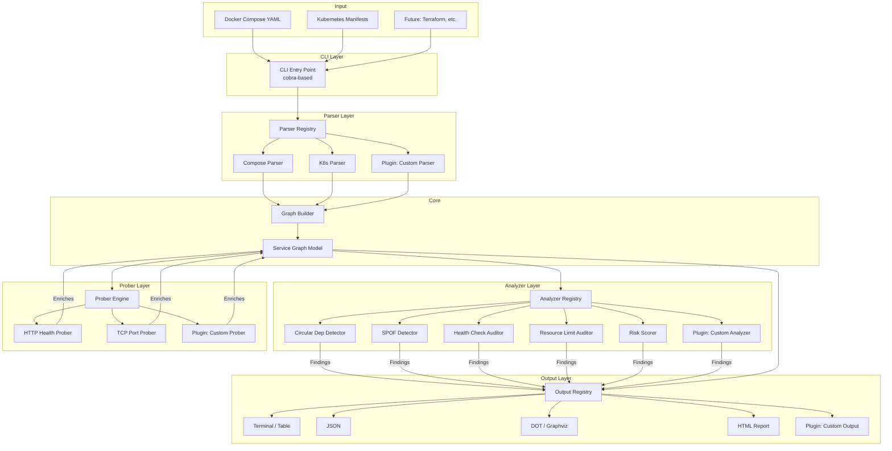
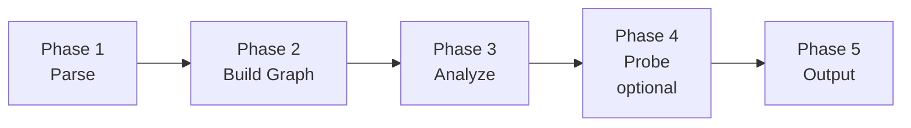
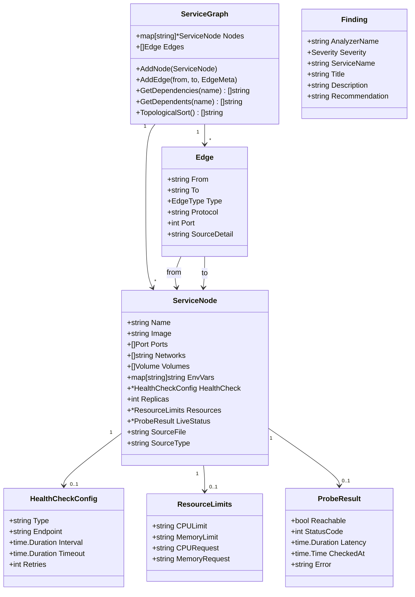
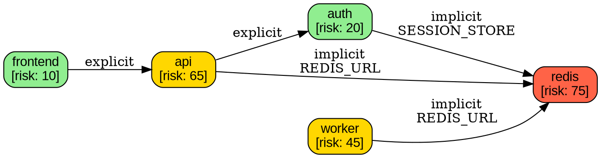

# depgraph — System Design Document

**Version:** 1.0  
**Author:** Alok Shukla  
**Date:** March 8, 2026  
**Status:** Draft — Pending Review

---

## 1. Problem Statement

Teams building distributed systems with microservices lack a lightweight, zero-dependency tool to analyze their service architecture for structural risks. Existing tools either require a running Kubernetes cluster with a service mesh (Kiali, KubeView), only draw static pictures without analysis (compose-viz), or are heavy commercial platforms (Datadog).

**depgraph** is an open-source CLI tool that performs static analysis and active probing of service architectures to detect structural risks — single points of failure, circular dependencies, missing health checks, and more — before they cause outages.

---

## 2. Goals and Non-Goals

### Goals (v1.0 — 2 week scope)

- Parse Docker Compose files and extract service dependency graphs
- Parse Kubernetes manifest files (Deployments, Services, ConfigMaps)
- Detect implicit dependencies from environment variables (e.g., `DATABASE_URL=postgres://db:5432`)
- Identify structural risks: circular dependencies, single points of failure, missing health checks, missing resource limits, no replicas
- Output results as: terminal summary, JSON, DOT (Graphviz), and HTML report
- Actively probe running services for health status and latency
- Produce a per-service risk score with actionable recommendations
- Plugin-friendly architecture so community can extend parsers, analyzers, and output formats

### Non-Goals (v1.0)

- Real-time monitoring or continuous watching
- Terraform/Pulumi parsing (future)
- Auto-remediation or code generation
- Distributed tracing integration
- Authentication or multi-user support

---

## 3. High-Level Architecture



---

## 4. Data Flow

The system processes data in 5 sequential phases:



### Phase 1 — Parse

The CLI detects input file type (Compose vs K8s) and routes to the appropriate parser. Each parser implements the `Parser` interface and returns a list of `ServiceDefinition` structs.

**Compose Parser extracts:**
- Service names, images, ports, networks, volumes
- Explicit dependencies (`depends_on`)
- Implicit dependencies (environment variables matching patterns like `host:port`, `scheme://host:port/path`, JDBC URLs)
- Health check definitions (`healthcheck` block)
- Replica counts (`deploy.replicas`)
- Resource limits (`deploy.resources.limits`)

**K8s Parser extracts:**
- Deployments → services with replica counts, resource limits, probe definitions
- Services → port mappings, label selectors (used to link services to deployments)
- ConfigMaps/Secrets → environment variable references that may encode service URLs
- Ingress → external entry points

### Phase 2 — Build Graph

The `GraphBuilder` takes the list of `ServiceDefinition` structs and constructs a directed graph:

- Nodes = services (with metadata: ports, health check config, replicas, resource limits)
- Edges = dependencies (with metadata: explicit vs implicit, protocol, port)

The graph is stored as an adjacency list with bidirectional lookup (both dependents and dependencies per node).

### Phase 3 — Analyze

Each analyzer implements the `Analyzer` interface. They receive the full graph and return `Finding` structs. Analyzers run independently and can be registered/deregistered.

| Analyzer | What It Detects | Severity |
|---|---|---|
| CircularDependency | Cycles in the dependency graph (DFS-based) | Critical |
| SinglePointOfFailure | Services with in-degree ≥ 2 and replicas = 1 | High |
| HealthCheckAuditor | Services missing health check definitions | Medium |
| ResourceLimitAuditor | Services missing CPU/memory limits | Medium |
| NetworkIsolation | Services on the default network with no isolation | Low |
| RiskScorer | Aggregates all findings into a per-service 0-100 risk score | Informational |

### Phase 4 — Probe (Optional, `--live` flag)

When running with `--live`, the prober attempts to reach each service's health endpoint. It enriches the graph with:

- Reachability (up/down)
- Response latency (p50, p95, p99 over N requests)
- HTTP status codes
- TLS status

The prober respects timeouts and concurrency limits. It does NOT modify any services — read-only probing.

### Phase 5 — Output

The enriched graph + findings are passed to the selected output formatter. Each formatter implements the `OutputFormatter` interface.

---

## 5. Core Data Model



### Enumerations

```go
type EdgeType string
const (
    EdgeExplicit EdgeType = "explicit"  // depends_on, links
    EdgeImplicit EdgeType = "implicit"  // env var URL pattern
    EdgeNetwork  EdgeType = "network"   // shared network
    EdgeVolume   EdgeType = "volume"    // shared volume
)

type Severity string
const (
    SeverityCritical      Severity = "critical"
    SeverityHigh          Severity = "high"
    SeverityMedium        Severity = "medium"
    SeverityLow           Severity = "low"
    SeverityInformational Severity = "info"
)
```

---

## 6. Interface Contracts (Plugin Points)

All extension points use Go interfaces. Third-party contributors register implementations via a registry pattern.

```go
// Parser reads a config file and returns raw service definitions
type Parser interface {
    // Name returns the parser identifier (e.g., "compose", "k8s")
    Name() string
    // CanParse returns true if this parser handles the given file
    CanParse(filePath string) bool
    // Parse reads the file and returns service definitions
    Parse(filePath string) ([]ServiceDefinition, error)
}

// Analyzer inspects the graph and returns findings
type Analyzer interface {
    // Name returns the analyzer identifier
    Name() string
    // Analyze runs detection logic over the graph
    Analyze(graph *ServiceGraph) ([]Finding, error)
}

// Prober checks live status of a service
type Prober interface {
    // Name returns the prober identifier
    Name() string
    // CanProbe returns true if this prober handles the service
    CanProbe(node *ServiceNode) bool
    // Probe checks the service and returns a result
    Probe(ctx context.Context, node *ServiceNode) (*ProbeResult, error)
}

// OutputFormatter renders the graph and findings
type OutputFormatter interface {
    // Name returns the formatter identifier (e.g., "json", "dot", "html")
    Name() string
    // Format renders the output to the writer
    Format(w io.Writer, graph *ServiceGraph, findings []Finding) error
}
```

### Registry Pattern

```go
// Each layer has a registry that mapps name → implementation
type ParserRegistry struct {
    parsers []Parser
}

func (r *ParserRegistry) Register(p Parser)          { r.parsers = append(r.parsers, p) }
func (r *ParserRegistry) FindParser(file string) Parser { /* iterate, call CanParse */ }
```

This pattern allows contributors to add new parsers (e.g., Terraform), new analyzers (e.g., security audit), or new output formats (e.g., Mermaid) without modifying core code.

---

## 7. CLI Design

```
depgraph — A linter for your distributed system architecture

USAGE:
    depgraph analyze [flags] <file>...
    depgraph probe   [flags] <file>...
    depgraph version

COMMANDS:
    analyze    Parse config files and report structural risks
    probe      Analyze + actively probe running services for health

ANALYZE FLAGS:
    -f, --format string      Output format: table, json, dot, html (default "table")
    -o, --output string      Write output to file instead of stdout
    --severity string        Minimum severity to report: critical, high, medium, low (default "low")
    --skip-implicit          Skip implicit dependency detection from env vars
    --no-risk-score          Skip risk score calculation

PROBE FLAGS:
    (inherits all analyze flags)
    --timeout duration       Per-service probe timeout (default 5s)
    --concurrency int        Max concurrent probes (default 10)
    --requests int           Number of probe requests per service (default 5)

GLOBAL FLAGS:
    -v, --verbose            Verbose output
    --no-color               Disable colored output
    -h, --help               Help for depgraph

EXAMPLES:
    depgraph analyze docker-compose.yml
    depgraph analyze -f json -o report.json docker-compose.yml
    depgraph analyze k8s-manifests/
    depgraph probe --timeout 3s docker-compose.yml
    depgraph analyze docker-compose.yml k8s/deployment.yaml
```

---

## 8. Project Structure

```
depgraph/
├── cmd/
│   └── depgraph/
│       └── main.go                 # Entry point
├── internal/
│   ├── cli/
│   │   ├── root.go                 # Root cobra command
│   │   ├── analyze.go              # analyze subcommand
│   │   └── probe.go                # probe subcommand
│   ├── model/
│   │   ├── graph.go                # ServiceGraph, ServiceNode, Edge
│   │   ├── finding.go              # Finding, Severity
│   │   └── types.go                # HealthCheckConfig, ResourceLimits, etc.
│   ├── parser/
│   │   ├── registry.go             # Parser registry
│   │   ├── parser.go               # Parser interface
│   │   ├── compose/
│   │   │   └── compose.go          # Docker Compose parser
│   │   └── k8s/
│   │       └── k8s.go              # Kubernetes manifest parser
│   ├── graph/
│   │   └── builder.go              # Builds ServiceGraph from ServiceDefinitions
│   ├── analyzer/
│   │   ├── registry.go             # Analyzer registry
│   │   ├── analyzer.go             # Analyzer interface
│   │   ├── circular.go             # Circular dependency detector
│   │   ├── spof.go                 # Single point of failure detector
│   │   ├── healthcheck.go          # Health check auditor
│   │   ├── resources.go            # Resource limits auditor
│   │   └── riskscore.go            # Aggregated risk scorer
│   ├── prober/
│   │   ├── registry.go             # Prober registry
│   │   ├── prober.go               # Prober interface
│   │   ├── http.go                 # HTTP health prober
│   │   └── tcp.go                  # TCP port prober
│   └── output/
│       ├── registry.go             # Output registry
│       ├── formatter.go            # OutputFormatter interface
│       ├── table.go                # Terminal table output
│       ├── json.go                 # JSON output
│       ├── dot.go                  # DOT/Graphviz output
│       └── html.go                 # HTML report with embedded graph
├── testdata/
│   ├── compose/
│   │   ├── simple.yml              # 2-service basic test
│   │   ├── voting-app.yml          # Docker voting app (5 services)
│   │   ├── online-boutique.yml     # Google Online Boutique
│   │   ├── circular.yml            # Deliberate circular dependency
│   │   ├── spof.yml                # Deliberate SPOF pattern
│   │   ├── env-links.yml           # Implicit env var dependencies
│   │   └── no-healthcheck.yml      # Services without health checks
│   ├── k8s/
│   │   ├── simple-deployment.yaml
│   │   └── online-boutique/        # Google Online Boutique K8s manifests
│   └── golden/                     # Expected outputs for snapshot tests
│       ├── voting-app.json
│       ├── voting-app.dot
│       └── ...
├── docs/
│   ├── DESIGN.md                   # This document
│   └── CONTRIBUTING.md             # How to add parsers, analyzers, outputs
├── .github/
│   └── workflows/
│       └── ci.yml                  # Build + test + lint
├── .goreleaser.yml                 # Release binary builds
├── go.mod
├── go.sum
├── LICENSE                         # Apache 2.0
├── README.md
└── Makefile
```

---

## 9. Implicit Dependency Detection

A key differentiator of depgraph is detecting dependencies that are NOT declared via `depends_on`, but are encoded in environment variables.

### Patterns Matched

| Pattern | Example | Extracted Dependency |
|---|---|---|
| `host:port` | `REDIS_HOST=redis:6379` | redis |
| `scheme://host:port` | `API_URL=http://auth-service:8080/api` | auth-service |
| `JDBC URL` | `JDBC_URL=jdbc:postgresql://db:5432/mydb` | db |
| `MongoDB URI` | `MONGO_URI=mongodb://mongo:27017/app` | mongo |
| `AMQP URI` | `AMQP_URL=amqp://rabbitmq:5672` | rabbitmq |
| Service name reference | `PAYMENT_SERVICE_HOST=payment` | payment (if "payment" is a known service name) |

The parser first collects all known service names, then scans environment variables for references to those names. This avoids false positives from external hostnames.

---

## 10. Risk Scoring Algorithm

Each service receives a score from 0 (safe) to 100 (critical risk), calculated as:

```
base_score = 0

# Structural factors
if no_health_check:          base_score += 20
if replicas == 1:            base_score += 15
if no_resource_limits:       base_score += 10
if on_default_network:       base_score += 5
if no_restart_policy:        base_score += 10

# Graph factors
if in_circular_dependency:   base_score += 25
if is_spof (dependents ≥ 2 and replicas ≤ 1): base_score += 30
if fan_in > 5:               base_score += 10  # many services depend on this

# Normalize
risk_score = min(base_score, 100)
```

Services are bucketed:
- **0-25:** Low risk (green)
- **26-50:** Medium risk (yellow)
- **51-75:** High risk (orange)
- **76-100:** Critical risk (red)

---

## 11. Technology Stack

| Component | Choice | Reason |
|---|---|---|
| Language | Go 1.22+ | Single binary, fast, strong ecosystem for CLI/infra tools |
| CLI framework | cobra | Standard for Go CLIs (kubectl, docker, gh all use it) |
| YAML parsing | `gopkg.in/yaml.v3` | Standard Go YAML library |
| K8s types | `k8s.io/api`, `k8s.io/apimachinery` | Official K8s structs for correct parsing |
| Table output | `olekukonez/tablewriter` | Terminal table rendering |
| HTTP client | `net/http` (stdlib) | No external dependency for probing |
| Testing | `testing` (stdlib) + `testify` | Standard Go testing with assertions |
| Linting | `golangci-lint` | Standard Go linter |
| Releases | GoReleaser | Cross-platform binary builds |
| CI | GitHub Actions | Free for open source |

---

## 12. Testing Strategy

### Layer 1 — Unit Tests

Each package has `*_test.go` files. Parsers are tested against YAML fixtures in `testdata/`. Analyzers are tested against programmatically constructed graphs with known properties.

### Layer 2 — Golden File Tests

For each test fixture, we generate output (JSON graph, DOT, HTML) and compare against committed golden files. On intentional changes, golden files are updated with `go test -update`.

### Layer 3 — Integration Tests (Week 2)

A small Docker Compose stack with health endpoints is used to test the prober. These tests are gated behind a `// +build integration` tag so they don't run in normal CI.

### Test Fixtures (Borrowed from Open Source)

| Source | License | What We Use |
|---|---|---|
| Docker's awesome-compose | Apache 2.0 | Multiple real compose files |
| Google Online Boutique | Apache 2.0 | 11-service K8s manifests + compose |
| Docker voting app | Apache 2.0 | 5-service compose with networks |
| Our own pathological configs | Apache 2.0 | Circular deps, SPOFs, missing checks |

---

## 13. Open Source and Extensibility

### License

Apache 2.0 — allows commercial use, modification, and distribution.

### Contributing Guide

`CONTRIBUTING.md` will document how to:
1. Add a new parser (implement `Parser` interface, register in `init()`)
2. Add a new analyzer (implement `Analyzer` interface, register in `init()`)
3. Add a new output format (implement `OutputFormatter` interface, register in `init()`)
4. Add test fixtures

### Code Style

- `golangci-lint` enforced in CI
- All exported functions have godoc comments
- Interfaces are defined in separate files from implementations
- No package-level globals except registries initialized in `init()`

---

## 14. Milestone Plan (Preview)

| Milestone | Duration | Deliverables |
|---|---|---|
| M1: Project skeleton + core model | Day 1-2 | Go module, CLI scaffold, data model, interfaces |
| M2: Compose parser | Day 3-4 | Parse compose YAML, extract services + explicit deps |
| M3: Implicit deps + graph builder | Day 5-6 | Env var parsing, graph construction, tests |
| M4: Analyzers | Day 7-8 | Circular dep, SPOF, health check, risk score |
| M5: Output formatters | Day 9-10 | Table, JSON, DOT, HTML outputs |
| M6: K8s parser | Day 11-12 | Parse K8s manifests, link to existing graph |
| M7: Live prober + polish | Day 13-14 | HTTP/TCP probing, README, GoReleaser, CI |

*Detailed milestones with acceptance criteria will be created after this design is approved.*

---

## Appendix A: Example CLI Output

```
$ depgraph analyze docker-compose.yml

depgraph v0.1.0 — Service Dependency Analyzer

📊 Service Graph Summary
  Services: 5
  Dependencies: 7 (4 explicit, 3 implicit)
  Networks: 2

⚠️  Findings (4)

  CRITICAL  Circular dependency detected: api → auth → user-db → api
  HIGH      Single point of failure: redis (3 services depend on it, replicas: 1)
  MEDIUM    No health check: api, worker, redis
  MEDIUM    No resource limits: api, worker

📈 Risk Scores

  SERVICE     SCORE   RISK
  redis         75    ████████████████░░░░  HIGH
  api           65    █████████████░░░░░░░  HIGH
  worker        45    █████████░░░░░░░░░░░  MEDIUM
  auth          20    ████░░░░░░░░░░░░░░░░  LOW
  frontend      10    ██░░░░░░░░░░░░░░░░░░  LOW
```

---

## Appendix B: Example DOT Output


